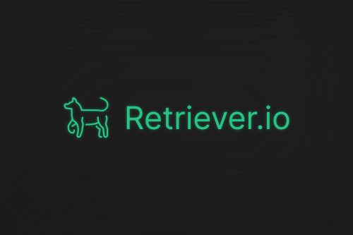
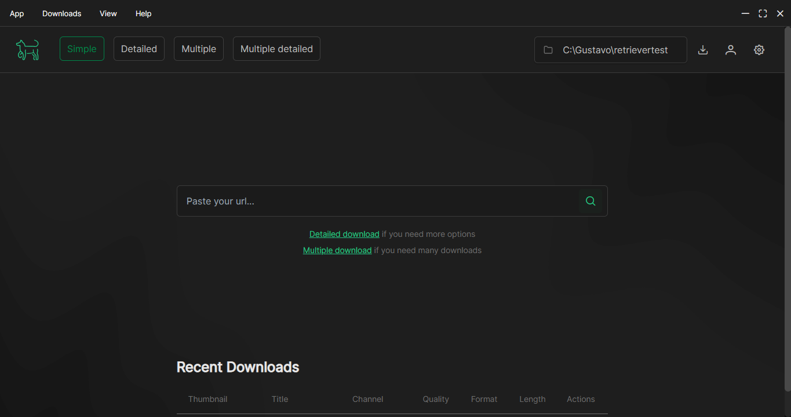

<div align="center">


[](https://v2.tauri.app) [](https://opensource.org/license/mit)
[](#contributing)

</div>

<p align="center"><i>An user friendly GUI for yt-dlp (🚧In progress🚧)</i></p>

<div align="center">
  
  
  
</div>

## 🐕 Introduction
<p align="justify"> 
Completely free, Retriever.io is a Open Source GUI that works as a frontend for yt-dlp, with a focus on making it easier to use for users with no programming experience.
</p>

Built in `Tauri` and using [yt-dlp](https://github.com/yt-dlp/yt-dlp) in the back-end (core functionalities), the app is capable of:
- Download videos from many websites, check the [supported websites](https://github.com/yt-dlp/yt-dlp/blob/master/supportedsites.md);
- Select a specific file extension;
- Trim the file;
- Download multiples files at once;
- 🚧(coming soon!) Edit multiple videos/audios at once🚧;

 

<p align="justify">Retriever.io is a tool that makes downloading public content easier. the end user is responsible for what they download, how they use and distribute that content.</p>

<p align="justify">According to the software license agreement, you must have the right to download the content you are downloading. You personally retain all responsibility for the content downloaded by you. This software is not intended for downloading copyrighted material.</p>

See the [yt-dlp documentation](https://github.com/yt-dlp/yt-dlp) for more information about using yt-dlp.


<br>

## 👨‍💻Development
If you want to contribute, see the [contributing](./contributing.md) section. Your help will be very important to build the project!
<details><summary>Pre-requisites</summary>
<br>
To be able to start development on Retriever++, make sure you have the following prerequisites:
<ul>
<br>
<li><a href="https://nodejs.org/en">Node (v18.20 or higher)</a></li>
<li><a href="https://www.npmjs.com">NPM (v10 or higher)</a></li>
<li><a href="https://v2.tauri.app/start/">Tauri enviroment ready</a></li>
</ul>
</details>

1. Clone the repository and install dependencies:
```
git clone https://github.com/gustavofdasilva/retriever.io
cd retriever.io
npm install
```
<br>

2. Run `npm run tauri dev` for a dev enviroment. The application will automatically reload if you change any of the source files.
```
npm run tauri dev
```
The development environment should now be set up.
<br>

## 💡Contributing
Retriever.io is an open-source project. I really apreciate any effort on it. You can help by: 
- Finding bugs; 
- Proposing new features;
- Improving the docs; 
- Improving the general design
- Many more!

Find the contributing guide [here](./contributing.md)

<br>

## 💬Stay in touch
- [Roadmap and Goals](https://github.com/gustavofdasilva/retriever.io/discussions/1)

<br>

## 🎨Assets used

### Logo

[OpenMoji](https://openmoji.org/library/emoji-1F415/#variant=black). License: [CC BY-SA 4.0](https://creativecommons.org/licenses/by-sa/4.0/#)

### Components
- [Prime vue](https://primevue.org)

### Icons

- [Prime icons](https://github.com/primefaces/primeicons)
- [Fontawesome](https://fontawesome.com)

### Background images

- [Haikei](https://app.haikei.app)

<br>

## 📃License
Retriever.io is licensed under the [MIT License](https://opensource.org/license/mit). See the LICENSE file for more information.
